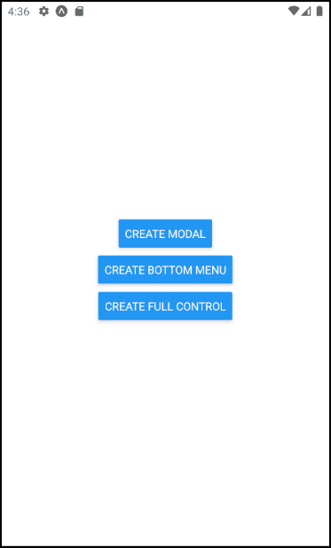

# Layers for React Native

A library for creating layers for React native, helpful with things like modals, menus etc.



## Installation

```sh
npm install layers-react-native
```

## Setup

### Example

See example folder for a basic example app using expo.

```jsx
import { StatusBar } from 'expo-status-bar';
import { Button, StyleSheet, Text, View } from 'react-native';
import { LayersProvider, useLayer } from 'layers-react-native';

const Page = () => {
  const { createLayer, closeLayerByUuid } = useLayer();

  const Modal = ({ layerUuid }: any) => <View style={{ width: 250, padding: 12, backgroundColor: "#FFF" }}>
    <Text>Modal</Text>
    <Button title="close" onPress={() => closeLayerByUuid(layerUuid)} />
  </View>

  const onPress = () => {
    createLayer({
      orientation: "modal",
      component: <Modal />
    });
  }

  return <View style={styles.container}>
    <Button title="Create modal" onPress={onPress} />
  </View>
}

export default function App() {
  return (
    <LayersProvider>
      <View style={styles.container}>
        <Page />
        <StatusBar style="auto" />
      </View>
    </LayersProvider>
  );
}

const styles = StyleSheet.create({
  container: {
    flex: 1,
    backgroundColor: '#fff',
    alignItems: 'center',
    justifyContent: 'center',
  },
});
```